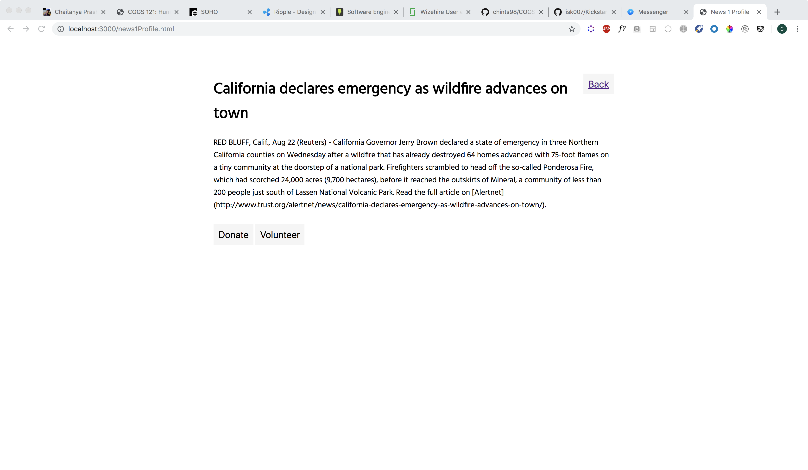
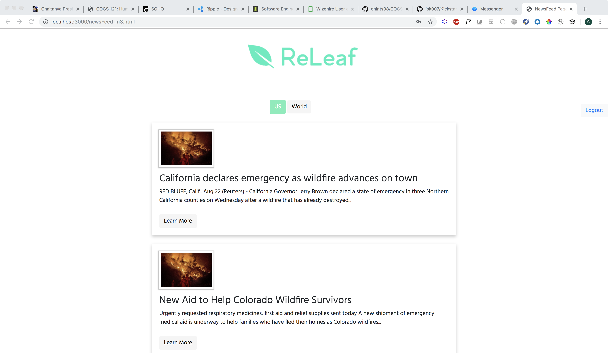
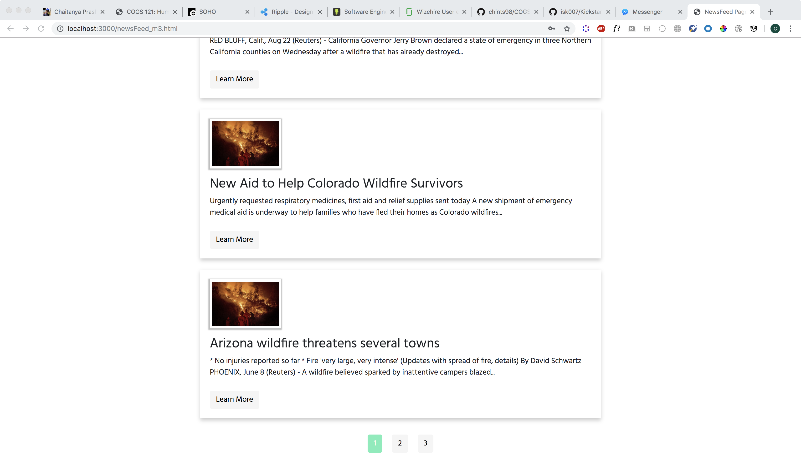

# milestone5

### Target User Population 

Setting + Sequence + Satisfaction

Referring back to our initial storyboarding process and ideating sessions, we are constantly changing embedded features in the app based on the needs of our target user population, which in this case, are the baby boomer demographic. Our app can be seen across various settings, such as at a household with a stay-at-home parent or at a busy work environment with a full-time working employee, who wish to keep up with upcoming tragic news occurring in the US and the world and find ways to help victims by either paying forward through donations or volunteering. In this case, both the stay-at-home parent or full-time working employee can use our app to avoid alternating between multiple apps to keep up with current events and avoid having to endlessly scroll on Facebook newsfeed to access popular GoFundMe pages that people post about for help. 

Our app can help both of these users to access current events that are related to tragic news or articles about victims of natural disasters through the newsfeed page and use the toggle button to alternate between US and World-based tragic news. Moreover, our app allows the users to “Learn More” about each of the current events by clicking for more information about the given article from the news source. From there, the users can either donate or volunteer for the cause. Our app allows the baby boomer demographic, including groups like stay-at-home parents and full-time working employees, to feel empowered by helping those in tragedy by either donating or volunteering, without having to surf through multiple apps at once or waste time by scrolling through social media newsfeed. 

### Screenshots 

Individual Article

News feed

Nav bar

### UI Improvements

Our UI screenshots have improved upon our versions from the previous Milestone 4 by incorporating a consistent visual design language and establishing a style guide to use throughout the app. We created a color palette to incorporate throughout the app with scenes of green and grey as primary and secondary colors and designed icons for each of the call-to-action items on the app, such as for the “Donate” and “Volunteer” button respectively. Moreover, we revised the style of the buttons based on its active versus inactive state by using the primary color for the active state button. We also consistently used the same font/point size for the header throughout the app and made alignment changes so that the app can look more visually appealing and polished. We also made final edits to the form that the user fills out when selecting “Volunteer”. 

### Implementation of Data Display

Our data is displayed via a news feed in the home page of the app. We thought that upon logging in, the user should immediately be able to see an overview of the latest disaster news articles. Thus, we use Ajax upon the page loading to automatically populate the container/feed with data of articles we fetch from a ReliefWeb API. 

We also used Ajax to load the next 3 articles with every page (access the next 3 articles with every page (access the next 3 in the stored articles returned) and used Ajax to do the location toggle between US & World News (pass in a different query to API). We also have JS Boolean variables to track what page we are on (to load the right articles) and which location filter we want to use (US vs World).

Regarding our use of the ReliefWeb API, it is an API that logs reports of disaster events worldwide so we felt it was relevant. We query for a specific keyword and also require the reports to have a headline and body. Then, we store the articles returned in a JS variable, which we access throughout to help populate the following pages as well.

We also decided to reduce the clutter on the news feed by displaying just the title and a snippet of the article, so that users can get the gist and click on "Learn More" if they are interested. This will lead them to a page dedicated to the individual article.

Each article also has a unique ID (from API), therefore we use this ID as a query field to the individual pages for each article, so we can match this ID when searching through the articles stored to return the corresponding title and body to display in the page for individual articles.

### Ambitious Data Display/Visualization Ideas 

Using our creativity, some of our ambitious data display ideas are related to embedding a line graph that plots the amount donated over time (in months, weeks, days, etc.) for each of the given causes listed out in the news article as this data would be immensely useful as a benchmark data for users to view if they are interested in donating for a cause. We also want to show a bar graph that reveals the proportion of likes to total page views and the proportion of dislikes to the total page views so that the users can see the general popularity of the given news or the general reaction from other viewers as they surf through the newsfeed. Moreover, we can potentially graph the geographic locations of people who click on each of the articles based on their IP addresses in the form of a heat map so that the users can build awareness on how much the given news is receiving attention from people worldwide. 

